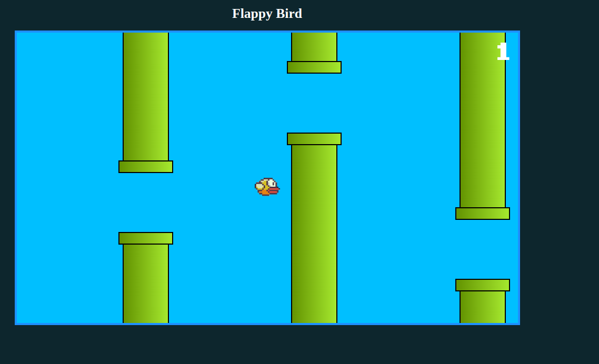

<h1 align="center">
    
</h1>

<h2 align="center">
   
🎮 Flappy Bird 🐦

</h2>

  

  

  <a href="#rocket-tecnologias">Tecnologias</a>&nbsp;&nbsp;&nbsp;|&nbsp;&nbsp;&nbsp;
  <a href="#computer-projeto">Projeto</a>

 
<h3>Imagem da Aplicação:<h3>

  

## :rocket: Tecnologias
- [HTML](https://www.w3schools.com/js/js_htmldom_document.asp)
- [CSS](https://devdocs.io/css/)
- [JAVASCRIPT](https://devdocs.io/javascript/)

## :computer: Projeto
> Projeto simulando o game flappy bird em javascript.

